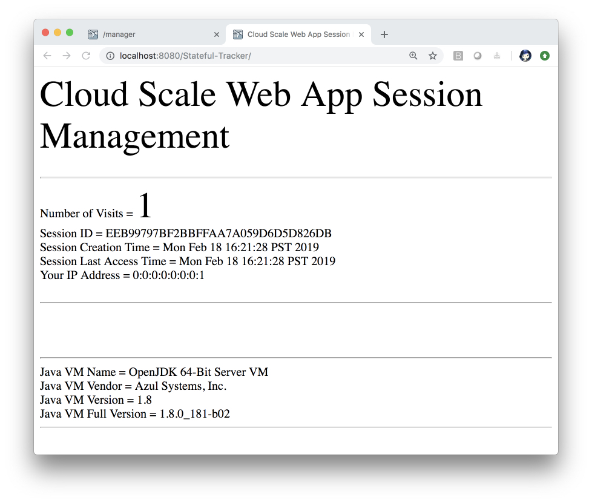

# Stateful Java Web App

This Java Web app is a STATEFUL Java Web app.

## Requirements

| [Java 8](https://www.azul.com/downloads/azure-only/zulu) | [Maven 3](http://maven.apache.org/) | [Git](https://github.com/) |

## HTTP == Stateless
HTTP is a [stateless protocol](https://tools.ietf.org/html/rfc7230#page-5). 
This means each time a client retrieves a Web page, the client opens 
a separate connection to the Web server and the server, 
by default, does not keep any record of previous client requests.

The Stateless Service design principle has become ubiquitous in the 
technology industry for creating horizontally scalable services. 

## Stateful Apps

When our applications carry state, we have moved all of it to 
caches and databases. This works well for business data and it 
must be balanced against request latency requirements.

One of the biggest demands as the Web's popularity grew was 
the ability to maintain state between requests that are specific to each client.

There is connection information between service e.g. when clients 
and services are communicating back and forth, some sort of 
correlation may be required in order to fire the subsequent 
request only to the particular instance of the service as only 
that instance knows about the previous service interaction. 
To realize this, service requires sticky connections.

Sticky connections can be implemented using persistent connections 
but problems with them include unequal distribution of load in 
backend servers. This can arise as clients get tied to 
servers and some servers might be underutilized whereas 
some may get overwhelmed with requests.
 
Sticky connections can also go haywire during crashes and load balancing in a
 cloud environment. Particularly, once the connection breaks, 
 the client is round robined to another server then that correlation is lost. 
 Another one when you load balance, the client cannot be talking to the 
 same server, but the client can be burst to another server.

Are stateful apps always useful? 
It is wasteful for chatty applications that have 
frequent communications between the server and the client 
and stateful services are a better option. Particularly, 
easier to develop when state is shared across invocations and, 
in general, the shared state is optimized for low latency.

## Stateful Java Web Apps

[Java Servlet](https://javaee.github.io/javaee-spec/javadocs/javax/servlet/http/package-summary.html) 
provides [HttpSession Interface](https://javaee.github.io/javaee-spec/javadocs/javax/servlet/http/HttpSession.html) 
which provides a way to identify a user across more than one 
page request or visit to a Web site and to store information about 
that user. Then, that stored information can be bounced around 
Web apps that make up a service and Web apps that are used to 
balance load for the service.

The Servlet container uses this interface to create a session 
between an HTTP client and an HTTP server. The session persists 
for a specified time period, across more than one connection or 
page request from the user.

This sample describes how to use the HttpSession object to store state and 
find out the 
session ID, creation time and the last-accessed time for a session. 
The Web app creates a new session with the request if one does not already exist.

## Externalizing Sessions to Data Store

External data stores, such as Redis Cache, Mongo DB or MySQL, 
can be used as an external cache for containers, such as Spring Boot, 
Tomcat and WildFly/JBoss. This allows external data store to store 
HTTP Sessions, among other data, independent of the application layer, 
which provides multiple benefits:

#### Application Composability - Multiple Apps of Service

By externalizing sessions and using multiple apps that form a service and 
bouncing users across these apps, you
can realize scenarios such as shopping cart state 
traveling with users as they navigate experiences
through multiple apps.

#### Application Elasticity

By making the application stateless additional Web apps may be added to 
the service cluster without expensive data rebalancing operations. The 
service cluster may also be replaced without downtime by keeping the 
state in the external data store, as upgraded Web apps may be brought 
online and retrieve the sessions.

#### Failover Across Data Centers

Should a data center become unavailable the session data persists, 
as it is stored safely within the external data store. This allows a 
load balancer to redirect incoming requests to a second cluster to 
retrieve the session information.

#### Reduced Memory Footprint

There is reduced memory pressure, resulting in shorter garbage 
collection time and frequency of collections, as the HTTP Sessions 
have been moved out of the application layer and into the backing caches.

#### Flexibility of External Data Store

External data store such as Azure Redis Cache is available in 
[multiple tiers](https://docs.microsoft.com/en-us/azure/azure-cache-for-redis/cache-overview#azure-cache-for-redis-offerings). 
“Premium tier Caches support more features and have higher throughput with 
lower latencies.” See [What Azure Cache for Redis offering and size should I use?](https://docs.microsoft.com/en-us/azure/azure-cache-for-redis/cache-faq#what-azure-cache-for-redis-offering-and-size-should-i-use)


## Build and Deploy the Stateful Java Web App

Use Maven to package and deploy:

```bash

# Change directory

cd stateful-java-web-app

# Build the package 

mvn package
[INFO] Scanning for projects...
[INFO] 
[INFO] ------------------------------------------------------------------------
[INFO] Building Stateful-Tracker 1.0.0-SNAPSHOT
[INFO] ------------------------------------------------------------------------
[INFO] 
[INFO] --- maven-resources-plugin:2.6:resources (default-resources) @ Stateful-Tracker ---
[INFO] Using 'UTF-8' encoding to copy filtered resources.
[INFO] Copying 1 resource
[INFO] 
[INFO] --- maven-compiler-plugin:3.8.0:compile (default-compile) @ Stateful-Tracker ---
[INFO] Changes detected - recompiling the module!
[INFO] Compiling 2 source files to /Users/selvasingh/stateful-java-web-app/target/classes
[INFO] 
[INFO] --- maven-resources-plugin:2.6:testResources (default-testResources) @ Stateful-Tracker ---
[INFO] Using 'UTF-8' encoding to copy filtered resources.
[INFO] skip non existing resourceDirectory /Users/selvasingh/stateful-java-web-app/src/test/resources
[INFO] 
[INFO] --- maven-compiler-plugin:3.8.0:testCompile (default-testCompile) @ Stateful-Tracker ---
[INFO] No sources to compile
[INFO] 
[INFO] --- maven-surefire-plugin:2.12.4:test (default-test) @ Stateful-Tracker ---
[INFO] No tests to run.
[INFO] 
[INFO] --- maven-war-plugin:3.2.2:war (default-war) @ Stateful-Tracker ---
[INFO] Packaging webapp
[INFO] Assembling webapp [Stateful-Tracker] in [/Users/selvasingh/stateful-java-web-app/target/Stateful-Tracker-1.0.0-SNAPSHOT]
[INFO] Processing war project
[INFO] Copying webapp resources [/Users/selvasingh/stateful-java-web-app/src/main/webapp]
[INFO] Webapp assembled in [105 msecs]
[INFO] Building war: /Users/selvasingh/stateful-java-web-app/target/Stateful-Tracker-1.0.0-SNAPSHOT.war
[INFO] ------------------------------------------------------------------------
[INFO] BUILD SUCCESS
[INFO] ------------------------------------------------------------------------
[INFO] Total time: 2.129 s
[INFO] Finished at: 2019-02-18T21:13:31-08:00
[INFO] Final Memory: 20M/307M
[INFO] ------------------------------------------------------------------------

# Deploy to local Tomcat

mvn cargo:deploy -Denv=local
[INFO] Scanning for projects...
[INFO] 
[INFO] ------------------------------------------------------------------------
[INFO] Building Stateful-Tracker 1.0.0-SNAPSHOT
[INFO] ------------------------------------------------------------------------
[INFO] 
[INFO] --- cargo-maven2-plugin:1.6.7:deploy (default-cli) @ Stateful-Tracker ---
[INFO] [edDeployerDeployMojo] Resolved container artifact org.codehaus.cargo:cargo-core-container-tomcat:jar:1.6.7 for container tomcat8x
[INFO] [mcat8xRemoteDeployer] Deploying [/Users/selvasingh/stateful-java-web-app/target/Stateful-Tracker-1.0.0-SNAPSHOT.war]
[INFO] ------------------------------------------------------------------------
[INFO] BUILD SUCCESS
[INFO] ------------------------------------------------------------------------
[INFO] Total time: 1.418 s
[INFO] Finished at: 2019-02-18T21:15:12-08:00
[INFO] Final Memory: 10M/309M
[INFO] ------------------------------------------------------------------------
```

Open the app:

```bash
open http://localhost:8080/Stateful-Tracker/
```



## Next Right Step - Scale Stateful Java Apps in Cloud

Go to - https://github.com/Azure-Samples/scaling-stateful-java-web-app-on-azure 

## References
- [Servlets - Session Tracking](https://www.tutorialspoint.com/servlets/servlets-session-tracking.htm)
- [Persistent Sessions](https://www.oxxus.net/tutorials/tomcat/persistent-sessions)
- [Scaling Stateful Services](https://www.infoq.com/news/2015/11/scaling-stateful-services)
- [Pivotal Session Managers: redis-store](https://github.com/pivotalsoftware/session-managers/tree/master/redis-store)
- [Externalize Sessions](https://access.redhat.com/documentation/en-us/red_hat_data_grid/7.1/html/administration_and_configuration_guide/externalize_sessions)
- [Cloud Scale Azure Redis Cache](https://docs.microsoft.com/en-us/azure/azure-cache-for-redis/cache-overview#azure-cache-for-redis-offerings)

# Contributing

This project welcomes contributions and suggestions.  Most contributions require you to agree to a
Contributor License Agreement (CLA) declaring that you have the right to, and actually do, grant us
the rights to use your contribution. For details, visit https://cla.microsoft.com.

When you submit a pull request, a CLA-bot will automatically determine whether you need to provide
a CLA and decorate the PR appropriately (e.g., label, comment). Simply follow the instructions
provided by the bot. You will only need to do this once across all repos using our CLA.

This project has adopted the [Microsoft Open Source Code of Conduct](https://opensource.microsoft.com/codeofconduct/).
For more information see the [Code of Conduct FAQ](https://opensource.microsoft.com/codeofconduct/faq/) or
contact [opencode@microsoft.com](mailto:opencode@microsoft.com) with any additional questions or comments.
